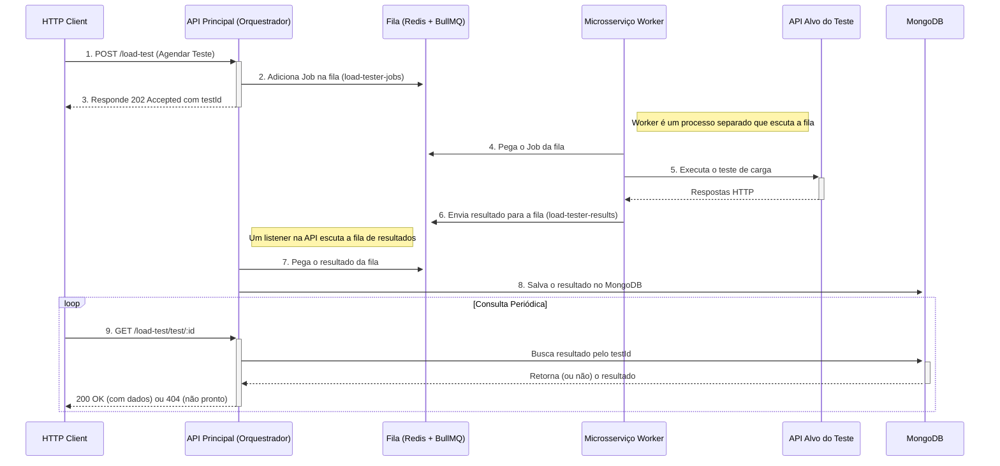

# Load Tester API

[](https://github.com/luisfelix-93/load-tester-api/actions/workflows/auto-pr.yml)
[](LICENSE)

Uma ferramenta de teste de carga para APIs HTTP/HTTPS, desenvolvida em Node.js com TypeScript e uma arquitetura escalável de microsserviços.

Este projeto permite agendar testes de carga pesados de forma assíncrona. Ele envia um grande volume de requisições a um endpoint e coleta estatísticas detalhadas de desempenho, que podem ser consultadas posteriormente.

## 📚 Sumário
- [Funcionalidades](#1-funcionalidades)
- [Arquitetura](#2-arquitetura)
- [Pré-requisitos](#3-pré-requisitos)
- [Instalação e Uso](#4-instalação-e-uso)
- [Documentação da API](#5-documentação-da-api)
- [Testes Automatizados](#6-testes-automatizados)
- [Configuração](#7-configuração)
- [Licença](#8-licença)

## 1. Funcionalidades

- **Agendamento Assíncrono**: Os testes são agendados e executados em background, sem bloquear a API principal.
- **Arquitetura Escalável**: Utiliza uma fila de mensagens (BullMQ) e um microsserviço worker dedicado para executar os testes, permitindo escalar o processamento de forma independente.
- **Métricas Detalhadas**: Coleta estatísticas completas, incluindo tempo de resposta (mín, máx, média), TTFB, contagem de sucesso/falha e vazão (requests/seg).
- **Persistência de Dados**: Os resultados são salvos em um banco de dados MongoDB para consulta e análise histórica.
- **Rastreabilidade**: Cada teste é identificado por um `testId` (UUID) único, facilitando o rastreamento do agendamento até o resultado final.

## 2. Arquitetura

O projeto utiliza uma arquitetura de microsserviços para desacoplar responsabilidades e melhorar a escalabilidade.



O fluxo funciona da seguinte forma:
1.  **API Principal (Orquestrador)**: Recebe a requisição HTTP para iniciar um teste. Ela não executa o teste, apenas valida os dados, gera um `testId` e adiciona um "job" na fila `load-tester-jobs`.
2.  **Fila de Mensagens (Redis + BullMQ)**: Atua como um intermediário. Garante que os jobs de teste sejam processados de forma confiável, mesmo que a API ou o worker reiniciem.
3.  **Microsserviço Worker (Executor)**: É um processo separado que escuta a fila `load-tester-jobs`. Ao receber um job, ele executa o teste de carga pesado. Ao finalizar, envia o resultado para outra fila, a `load-tester-results`.
4.  **API Worker Interno**: Dentro da API principal, um processo em background escuta a fila `load-tester-results`. Quando um resultado chega, ele o salva no MongoDB, associando-o ao `testId` original.

## 3. Pré-requisitos

- **Node.js** (versão 18 ou superior)
- **Docker** e **Docker Compose**
- **Git**

## 4. Instalação e Uso

A maneira mais fácil de executar o projeto completo (API, Redis, MongoDB) é usando Docker Compose.

```bash
# 1. Clone o repositório
$ git clone https://github.com/luisfelix-93/load-tester-api.git

# 2. Acesse a pasta do projeto
$ cd load-tester-api

# 3. Crie um arquivo .env a partir do exemplo
# (Não é necessário alterar nada para rodar localmente com Docker)
$ cp .env.example .env

# 4. Suba os contêineres (API, Redis, Mongo) em modo "detached" (-d)
$ docker-compose up --build -d
```

A API estará disponível em `http://localhost:4000` (ou na porta que você definir em `.env`).

Para parar os serviços, execute:
```bash
$ docker-compose down
```

## 5. Documentação da API

A API permite agendar e consultar os resultados dos testes de carga.

### 5.1 Rotas

- `POST /load-test`
- `GET /load-test`
- `GET /load-test/test/:id`
- `GET /load-test/by-date`

--- 

#### **POST /load-test**

Agenda um novo teste de carga de forma **assíncrona**.

**Request Body**
```json
{
  "targetUrl": "string",      // URL do endpoint a ser testado
  "numRequests": "number",    // Número total de requisições a serem enviadas
  "concurrency": "number",    // Número de requisições simultâneas
  "method": "string",        // (Opcional) Método HTTP, ex: "POST"
  "payload": { ... },         // (Opcional) Corpo da requisição para métodos como POST/PUT
  "headers": { ... },         // (Opcional) Cabeçalhos HTTP personalizados
  "timeout": "number"         // (Opcional) Timeout em ms
}
```

**Resposta (`202 Accepted`)**

A API responde **imediatamente** que o teste foi agendado. A resposta contém um `testId` que você usará para consultar o resultado final.

```json
{
  "message": "Teste de carga agendado com sucesso.",
  "testId": "a1b2c3d4-e5f6-7890-1234-567890abcdef"
}
```

--- 

#### **GET /load-test**

Retorna todos os testes de carga realizados.

--- 

#### **GET /load-test/test/:id**

Retorna os detalhes de um teste de carga específico, usando o `testId` retornado no agendamento.

**Resposta (`200 OK`)**
```json
{
  "_id": "652f1b7b3f3e8a1d8f3e8a1d",
  "testId": "a1b2c3d4-e5f6-7890-1234-567890abcdef",
  "url": "https://api.exemplo.com/endpoint",
  "requests": 50,
  "concurrency": 5,
  "result": [...],
  "stats": {...},
  "createdAt": "2023-10-17T20:00:00.000Z"
}
```
- **404 Not Found**: Teste não encontrado. Isso pode significar que o `testId` é inválido ou que o teste ainda está em andamento.

--- 

#### **GET /load-test/by-date**

Retorna os testes realizados dentro de um intervalo de datas.

**Query Parameters**
- `startDate`: Data inicial no formato ISO (ex: `2023-10-17`).
- `endDate`: Data final no formato ISO (ex: `2023-10-18`).

## 6. Testes Automatizados

O projeto utiliza **Jest** para testes unitários e de integração.

- **Testes Unitários**: Focam em componentes isolados (controllers, services) e usam "mocks" para simular dependências. Eles são rápidos e não precisam de serviços externos.
- **Testes de Integração**: Verificam a interação entre os componentes e os serviços reais (MongoDB, Redis). Eles são mais lentos e requerem um ambiente completo.

### Como rodar os testes

```bash
# Execute todos os testes (unitários e de integração)
# Requer MongoDB e Redis rodando localmente
$ npm test

# Rode em modo "watch" (útil durante o desenvolvimento)
$ npm run test:watch
```

## 7. Configuração

As configurações da aplicação são gerenciadas por variáveis de ambiente.

1.  Crie um arquivo `.env` na raiz do projeto.
2.  Copie o conteúdo de `.env.example` para o seu novo arquivo `.env`.
3.  Altere os valores conforme necessário para o seu ambiente.

**Variáveis Disponíveis:**

- `API_PORT`: Porta em que a API será executada (padrão: `4000`).
- `MONGO_URI`: String de conexão para o MongoDB.
- `REDIS_HOST`: Host do servidor Redis.
- `REDIS_PORT`: Porta do servidor Redis.

## 8. Licença

Este projeto está licenciado sob a [MIT License](LICENSE).
